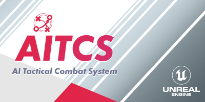
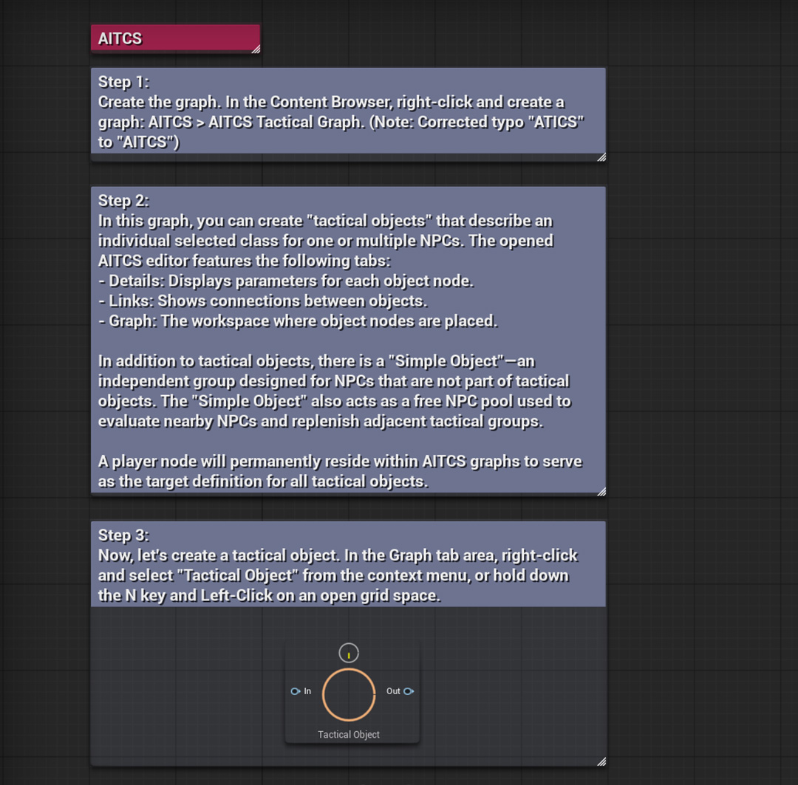
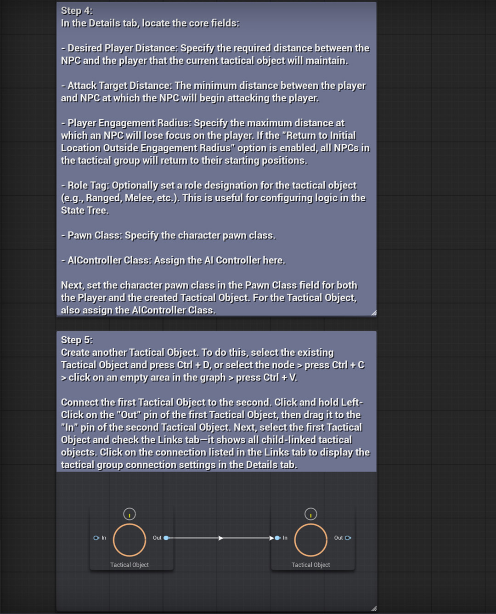
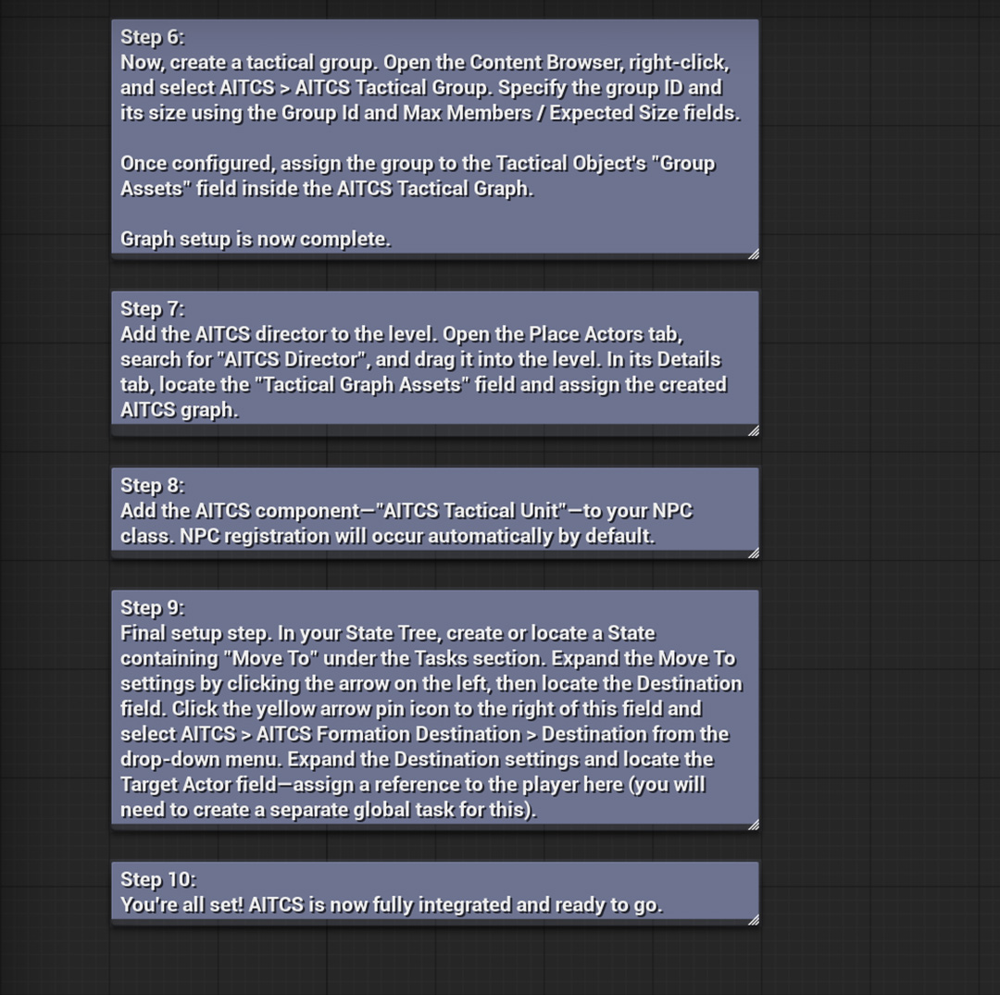

# AI Tactical Combat System
AITCS is a modular framework for Unreal Engine 5 designed to create coordinated NPC behavior in combat scenarios.

 

> [!NOTE]
> The plugin has been pre-packaged only for Win64 and Android.

> [!NOTE]
> This is an alpha version of the plugin and is still under development.

## Latest Updates
`Alpha` `Development` `Experimental`

`Version 0.0.13`
- Built for Unreal Engine 5.7.4.
- Added a fix for an issue where NPCs would suddenly stop pursuing the player if the player jumped. This feature triggers automatically, but can be configured in the StateTree.

## What it's for
- Setting up coordinated combat scenarios for in-game AI.

## Features
- The core AITCS philosophy: Designed to complement native Unreal Engine functionality rather than replace it.
- Graph Editor: Configure and manage NPC formations within a unique custom graph editor.
- State Tree Integration: Seamlessly utilize built-in functions to pass key parameters directly from the active AITCS graph.
- Module Factory: More than a standard plugin, AITCS acts as a versatile framework, allowing you to independently extend and add complexity to your existing AI logic.

## Alpha Version: Current Features
- AITCS Tactical Graph Editor: Built to support core functionality for NPC tactical configuration.
- AI Director: Initial version implemented.
- Formation Management: NPC formations are fully controlled via selected AITCS graph settings.
- System Hand-off: Functionality to release NPCs from AITCS control and return them to the standard Unreal Engine system.
- Blueprint Functions & Subsystem: Includes additional custom Blueprint functions and an integrated AITCS subsystem.

## Install

> [!NOTE]
> Starting with Unreal Engine version 5.6, it is recommended to use the new project type based on C++. After copying the plugin folder, be sure to perform a full project rebuild in your C++ IDE.

1. Make sure the Unreal Engine editor is closed.
2. Move the "Plugins" folder to the root folder of your created project.
3. Rebuild the project in your C++ IDE.
4. Done! If the plugin folder is not visible, activate visibility through the browser settings: `Settings > Show Plugin Content`.

## How to use it?
An interactive step-by-step tutorial on how to use AITCS can be found in the file: `AITCS_Demo`, which is located at the path `Plugins\AITacticalCombatSystem\`.

## (C++) Documentaion
Documentation is a work in progress.
